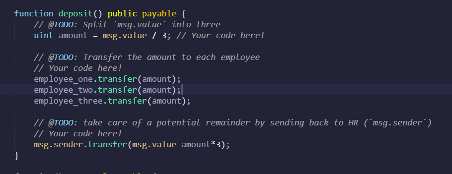

# Associate Profit Splitter

## Smart Contract
- Goal is to deploy a contract that will accept ether and divide evenly among associate level employees

Step 1) Defining Public Variables

Step 2) Creating Constructor that Accepts Payable Addresses

Step 3) Balance Function
    - already defined by StarterCode

Step 4) Deposit Function

    - Uses Global Variables "msg.sender" and "msg.value"

Step 5) External Payable Function

## Deploying Contract
    1. Enviornment set to "Injected Web3" to connect to LocalHost in MetaMax
    2. Initial value set to 0 wei
    3. Addresses taken from Ganache

## Test Transaction

    - Account information for the sending account and 3 recipient accounts

    1. After deploying contract, set up transaction parameters (in this case, value of deposit is 3 ETH, distributing 1 ETH to all three accounts in Address fields)

    2. Confirm transaction through MetaMax -- Success

    3. Updated Account Figures in Ganache

    Note: I had difficulty with this step and tried a few minor transactions (through MetaMax) that affected the account balances prior to this successful transaction (in case you were wondering why the Pre Transaction Amount Balances don't match with the Updated Account figures)